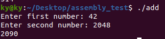

+++
title = "Learning x86-64"
description = "Get close to the CPU because it's a really cool machine"
slug = "learning-x86-64"
date = 2023-11-08
+++

# Let's learn x86-64

I have recently been playing [Shenzhen I/O](https://en.wikipedia.org/wiki/Shenzhen_I/O) and it reminded me of when I took a course in college where I learned some basic [MIPS](https://en.wikipedia.org/wiki/MIPS_architecture). I figured it might be fun to learn some more assembly, specifically one that is more popular in use. I figured I would try to make something that sounded "simple", a program in x86-64 that allows a user to input two numbers which are then added together and displayed.

# Adding is supposed to be easy

This idea in a higher level language is extremely simple and pretty commonly used when first learning a language or learning programming. The following is an example of what we want to do, written in Rust.

```rust
use std::io::{stdin, stdout, Write};

fn main() {
    // Define a buffer to hold our user input
    let mut input = String::new();
    
    // Get a number from our user
    print!("Enter a number: ");
    std::io::stdout().flush().unwrap(); // Flush the buffer to output as print! doesn't do that for performance
    stdin().read_line(&mut input).expect("Didn't get a string");
    let input_without_newline = &input[..input.len() - 1]; // We need to remove the newline at the end of the string
    let first_num = input_without_newline.parse::<i32>().unwrap();
    
    // Reset the buffer value and get a second number from our user
    input = "".to_owned();
    print!("Enter a second number: ");
    std::io::stdout().flush().unwrap();
    stdin().read_line(&mut input).expect("Didn't get a string");
    let input_without_newline = &input[..input.len() - 1];
    let second_num = input_without_newline.parse::<i32>().unwrap();
    
    // Add the numbers together and display them
    let result = first_num + second_num;
    println!("Your added numbers: {}", result);
}
```

This program prompts a user to enter two numbers and prints their sum. The components of this program which we care about are:
1. Create some buffer to hold user input
2. Prompt the user to enter a number
3. Read user text input
4. Convert the user text input into an integer, removing any excess non-int data (like a newline)
5. Repeat the previous three steps to get a second integer
6. Add our two numbers together
7. Convert our sum into a string and display it to the user

# Hello, World!
We will be using the [NASM](https://www.nasm.us/) assembler. Before writing our adding program, let's make a Hello World so we have a baseline program to build from.

```nasm
; I am a comment
section .data
    msg db "Hello world",13,10

section .text
    global _main

_main:
    mov rax, 1
    mov rdi, 1
    mov rsi, msg
    mov rdx, 13
    syscall
    jmp .exit

.exit:
    mov rax, 60
    mov rdi, 0
    syscall
```

This program is made to be run on Linux, assembly is platform specific.

## Sections
There are two "sections" we care about right now, `.data` and `.text`.

The data section is where we declare static variables. Here, we define a `msg` variable which will hold the string `"Hello world"`. The `13,10` portion of our string
corresponds with the ASCII characters for "carriage return" and "line feed". This is akin to writing `"Hello world\r\n"` in a language like Python. The `db`
stands for "define bytes" and allocates bytes to hold our string value.

The text section is where we actually write our program. Our text section begins with `global _main`, which defines the entry-point for our program.

## Comments
Comments in nasm begin with `;`.

## Instructions
Our `_main` function contains four `mov` instructions, a syscall, and then a jump to another area in the assembly. The `mov` instruction takes the format of `MOV <destination> <source>`, where we are moving a value from the source (which can be a static value, variable, or another register) into the destination. In the `mov rax, 1` instruction we are moving the static value `1` into the `rax` register. A register is a tiny piece of memory your CPU can access very quickly. A list of registers can be found in many places on the internet, [this Stanford resource](https://web.stanford.edu/class/cs107/guide/x86-64.html) being an example.

## What is a syscall?
When working with assembly, we work in a low level space where privilege is an important concept and we need to care about "userspace" and "kernel-space". Our program runs in "userspace" and lacks permissions to do many of the operations we want to do, like write to an output and get user input. We need to ask the OS to do those things for us. A syscall suspends our program and returns control to the OS, which will then examine pre-determined registers for data which tells it what we want it to do.

The `rax` register tells the OS what function to run when we make a syscall and registers `rdi`, `rsi`, and `rdx` provide three arguments to that function. Here we move 1 into `rax`, which tells the OS that we want to call `sys_write`. We can see in the [Linux kernel code](https://git.kernel.org/pub/scm/linux/kernel/git/torvalds/linux.git/tree/fs/read_write.c) that `sys_write` expects three arguments: a file descriptor, a buffer, and a size. We move 1 into `rdi` to indicate our file descriptor (0 is std_input, 1 is std_output, 2 is std_error), our string variable into `rsi`, and the size of our string into `rdx`. We then make a syscall, which suspends our program and causes the OS to read those four registers, print our string to the screen, and then resume our program.

## Ending our program
After we print "Hello world" we jump to the `.exit` label and make another syscall. We move 60 into `rax`, which tells the OS that we want to exit our program. The exit takes a single argument, the exit code. Our program has run successfully so we will move a 0 into `rdi` to indicate a successful status. Once we syscall here, our program ends.

## Actually running the program
We can run our program by creating an object file and then linking the two to create a binary. The below will create an elf64 binary file named `hello` from a `hello.asm` assembly program which you can run on Linux:
```sh
nasm -f elf64 -o hello.o hello.asm
ld -o hello hello.o
```

# Hello, Math!
Now we want to translate the Rust code from earlier into an assembly program.

## Create a buffer to hold user input
We are going to define a variable to use as a buffer for our user input, but we are going to use a new section to define it. In addition to the data and text sections, we can also define a "block starting symbol" section where we can declare a variable which has not been assigned a value. We are going to define a buffer which can hold 64 bytes, an arbitrary and large size.

```nasm
section .bss
    read_buffer resb 64
```

## Prompt the user to enter a number
This is the easy bit, as we already figured out how to do this in our "Hello, World!" example. Here we can define two prompt strings in our data section and then print to the screen in our text section.

```nasm
section .data
    first_msg db "Enter first number: "
    first_msg_len equ $ - first_msg ; This variable is going to store the length of our string, for ease of use
    second_msg db "Enter second number: "
    second_msg_len equ $ - second_msg

section .text
    global _start

_start:
    ; Ask our user to enter a number
    mov rax, 1
    mov rdi, 1
    mov rsi, first_msg
    mov rdx, first_msg_len
    syscall

    ; We will get user input here later

    ; Repeat the above with our second_message variables
    ; ...
```

## Read user text input
We are going to make a new function to perform this action to aid both in readability and to allow us to re-use it. We are also going to use a new syscall with code 0, `sys_read`. `sys_read` takes three arguments, a file descriptor (see above), a buffer, and a buffer size. `sys_read` also has a return value which we care about, the number of bytes written. When a syscall returns a value, that value will be placed in the `rax` register by the OS before control is returned to our program.

```nasm
;...

_start:
    ; ...

    call _read_number
    
    ; ...

_read_number:
    ; Function prologue
    push rbp
    mov rbp, rsp

    ; call "sys_read"
    mov rax, 0
    mov rdi, 0 ; file_descriptor 0 is std_input
    mov rsi, read_buffer
    mov rdx, 20 ; We are giving an arbitrarily large buffer size here
    syscall
    
    ; Convert our text into a number and store it in r12
    ; This will be explained in the next section
    call _read_buffer_to_number

    ; Function epilogue
    mov rsp, rbp
    pop rbp
    ret
```

The `call` and `ret` instructions here manage a pointer which tells the CPU where it is executing in the program. When we `call`, the address of the next instruction is stored on the stack so we know where to come back to and resume execution when our function finishes. When we call `ret`, the top value on the stack is read and replaces the instruction pointer. It is typical when writing a function in assembly to include a "prologue" and "epilogue" before and after your functions main code so, if your function uses the stack, you don't cause a problem when `ret` tries to grab the address left for it by `call`. This program is not using the stack, but since the purpose of this exercise is to learn, the prologue/epilogue are included anyway.

After we syscall, the OS will fill our `read_buffer` with whatever the user inputs and store the number of bytes written into `rax.`

## Convert the user text into an integer
If we try to do any math with the number input by a user here, the output will not make sense. If our user enters `1` then the integer value stored in our `read_buffer` is going to be `2609` in decimal, or `0x0A31` in hex. On a little endian machine like mine this corresponds to the ASCII value for "1" (`49` in decimal, `0x31` in hex) followed by a line feed (`10` in decimal, `0xA` in hex). In order to treat the input like a number so we can do math with it, we need to remove the linefeed and convert the ASCII number into an integer number.

The process of converting our digits is two-fold. First, we first must take an ASCII digit and subtract 48 from it. Since the ASCII value of "1" is 49, subtracting 48 will bring the value to what we expect it to be. Second, we need to accumulate our digits. If our user enters a number with more than one digit, like 105, then every time we read a digit we must multiply our accumulated number by 10 before adding a digit.

The following was my first pass at this, but it contains a bug that prevents it from working as expected.

```nasm
_read_buffer_to_number:
    ; rax here is the number of bytes that we just wrote to read_buffer
    mov r12, 0 ; Our accumulator
    mov r10, 0 ; Loop counter
    .loop:
        ; The instruction below this comment causes a bug
        mov r9, [read_buffer + r10] ; mov char from read_buffer into a register
        sub r9, 48 ; subtract 48 (converting ASCII into decimal)
        ; fold the number into an accumulator
        ;    acc = acc x 10
        ;    acc = acc + new_char
        imul r12, 10
        add r12, r9
        add r10, 1 ; Increment loop counter
        mov r11, r10 ; Set a temporary register we will use for comparison
        add r11, 1 ; Add 1 to tmp register, this is to account for the newline we want to ignore from our input
        cmp r11, rax ; Compare how many digits we have read to rax, which holds how many characters were written
        jl .loop ; Loop again if we have not read all digits
    ; r12, the accumulator, is our return value
    ret
```

The snippet above contains a `loop` label representing a loop, the `r12` register representing the number we are accumulating (and our output), and a loop counter stored in the `r10` register. In our loop we move data out of the `read_buffer` and into the `r9` register, subtract 48 to convert the value from an ASCII digit to a number, and fold the number into our accumulator. We then increment our loop counter and compare it to `rax` which contains the number of bytes written by the user in the previous syscall. If our loop counter is less than the number of bytes written, we jump to the `.loop` label to read another digit.

## Debugging assembly
The `_read_buffer_to_number` function is very close to functional but contains a bug that stops it from doing what we expect it to. This is a good time to learn how to debug an assembly program. Higher level languages have very convenient debuggers built into IDEs and the classic `print("I am here")` if one does not want to use a debugger. Neither of these are viable strategies in our assembler. We are going to use `gdb` to debug. To start, we need to generate debug symbols. We're going to change how we were generating our binary file like so:

```sh
nasm -f elf64 -gdwarf -o add.o add.asm
ld -o add add.o
```

Next, run `gdb` with the binary as an argument:

```sh
gdb ./add
```

We want to debug the _read_buffer_to_number function, so add a breakpoint like:

```sh
(gdb) b _read_buffer_to_number
```

Then enter "run" to begin execution of the program. After we enter our number, the breakpoint will trigger. Entering "next" will cause the debugger to step forward by one instruction, we will step until we run the `mov r9, [read_buffer + r10]` instruction. After that instruction is run we can enter "info registers" to display all of our registers and the values they currently contain. If we run that here we can see that `r9` contains the full user input value (`0xa31` in hex if the user entered "1"). This is not what we want and will cause unexpected behavior, we want one byte to be read at a time and we do not want the line feed byte to be included.

The `mov` instruction in nasm will move the entire value from the source into the destination. We can replace it with a more specific move instruction, `movzx`, and specify that we only want to move a byte. Our move instruction will now look like:

```nasm
movzx r9, byte [read_buffer + r10]
```
The "zx" portion of the instruction stands for "zero extend". A single byte will be moved and any remaining space will be filled with zeros to "extend" it to be a word.

## Add our numbers together
After we have two numbers, adding them together is a simple task. We will use a variable to store our sum.

```nasm
section .data
; ...
sum: dq 0

section .text

; Enter _start, prompt the user to enter a number, call _read which itself calls _read_buffer_to_number
; _read_buffer_to_number leaves our user input number in r12
add [sum], r12

; Repeat for the second input number
```

Above, we are using a `sum` variable to store the sum of the user input numbers. It is initialized to be 0 and then both times a number is entered, that numer is added to `sum`. The brackets in the `add` instruction act to dereference the variable and add to the value it holds.

## Convert our sum into a string
Once we have our sum, the number must be converted into a string so it can be displayed to the user.

```nasm
_int_to_string:
    ; Function prologue
    push rbp
    mov rbp, rsp

    ; Input is in r12
    mov r10, 0 ; Loop counter
    .div_loop:

        mov rax, r12 ; Move the lower 32 bits of the dividend into rax
        mov rdx, 0 ; Clear RDX (0 out the upper 32 bits of the dividend)
        mov rbx, 10 ; Move the divisor into rbx
        div rbx ; Divide rdx:rax by rbx
        mov r12, rax ; Replace r12 with the quotient
        mov r11, rdx ; Place our remainder in r11

        add r11, 48 ; Convert our int into an ASCII number
        push r11 ; Push our digit onto the stack. We push/pop the digits so our string reads in the correct order
        add r10, 1 ; increment counter
        ; If r12 is greater than 0 then we still have more digits to read
        cmp r12, 0
        jg .div_loop

    ; Pop the digits off of the stack
    mov r11, 0 ; Second loop counter
    .pop_loop:
        pop r13
        mov [read_buffer + r11], r13b ; Move the least significant byte from r13 into the read buffer
        add r11, 1 ; increment counter
        cmp r11, r10 ; compare the loop counter against the number of digits that were stored on the stack
        jl .pop_loop ; If our loop counter is smaller, we have more digits to pop

    ; Add a line feed to read_buffer
    mov [read_buffer + r11], byte 10
    add r10, 1 ; Increment the number of characters we wrote by one to account for the line feed

    ; Set r12 to be our string output
    mov r12, read_buffer
    ; Set r13 to be the number of characters we wrote to the string
    mov r13, r10

    ; Function epilogue
    mov rsp, rbp
    pop rbp
    ret
```

This function takes a number as an input in the `r12` register. The first loop divides the value in `r12` by 10 to pop off the rightmost digit, converts it to an ASCII representation, and then pushes it onto the stack. If our remaining value is greater than 0, then we still have digits to read and the loop repeats. The second loop pops our ASCII digits off of the stack and into our string buffer. A line feed is then added and we return our string in the `r12` register and its length in the `r13` register (the string is also "returned" into the buffer).

The process of pushing and then popping our digits to and from the stack ensures that the number is built in the correct order. The first loop, which gets each digit and converts them, reads the digits from back to front. This causes our number to appear backwards. Since the stack is LIFO, pushing our digits to the stack as we read them and then taking the digits out when we are building the string will reverse their order into being correct.

After running this function, the `r12` and `r13` registers contain our string and its length. Supplying these for a `std_write` syscall finishes our program and displays the result to the user.

## Running the program
The adding program now works, with some limitations. It cannot add negative numbers or non-whole numbers, we would need to check for "-" and "." ASCII characters and handle them accordingly.



## Epilogue
I began this program with the intent on just adding two numbers together but ended up spending all of my time writing it on type conversion. Working without a standard library shows how convenient it is that most languages come with the batteries included and you don't need to worry about converting a string to a number beyond `my_string.parse::<i32>()`.
