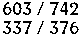
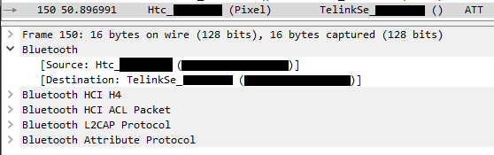

+++
title = "Python Bluetooth Controller using OCR"
description = "Figuring out how to utilize OCR and BlueTooth through Python"
slug = "python-bluetooth-controller"
date = 2020-10-26
[taxonomies]
categories = ["web development"]
tags = ["python", "ocr", "bluetooth"]
+++

# LED Strips and Video Games

It's a well known fact that computer gamers love RGB. A cheap and easy way to add RGB lighting to a computer setup is with an LED light strip and a simple Bluetooth strip only costs a few dollars on Amazon. The only pain is that they need to be manually controlled; a strip isn't really integrated with the computer setup. Python can be used to solve this issue, directly integrating a Bluetooth LED strip with computer processes. I thought it would be fun to have my LED strip change colors while playing [League of Legends](https://na.leagueoflegends.com/en-us/) to represent my health in the game. The strip would be red at very low health and green at high health values.

# Reading a Computer Screen

PIL stands for Python Imaging Library and was a library which allowed Python to manipulate image files. PIL was discontinued but has been succeeded by a fork to the project called [Pillow](https://pillow.readthedocs.io/en/stable/). Beyond the capability to edit images, Pillow allows us to stream images directly off of a computer monitor.

## Tesseract OCR

One of the largest draws of Python is how its syntax and ecosystem allow for complicated expressions and tasks to be utilized in few lines of code. Python is routinely used in machine learning applications, like OCR. [Tesseract OCR](https://github.com/tesseract-ocr/tesseract) is an open source OCR engine maintained by Google. [PyTesseract](https://pypi.org/project/pytesseract/) is a wrapper for Tesseract allowing Python to use the OCR engine.

## Putting It All Together

Making a simple screen reader with OCR capability is surprisingly easy.

```python
from PIL import ImageGrab
import pytesseract
x = 0
y = 0
offx = 100
offy = 100
img = ImageGrab.grab(bbox=(x, y, x + offx, y + offy))
probable_string = pytesseract.image_to_string(img)
print(f"Tesseract thinks our image says: {probable_string}")
```

The above snippit will create a square image out of your computer monitor starting from the top left corner with a length and width of 100 pixels. It passes this image to Tesseract, which will try to turn that image into a string.

Surprised about how easy it was to come this far, I assumed that I was essentially finished with the "read values from the screen" portion of the program. I got into a League of Legends match and pointed the program to the area of the screen where my health was and took damage, expecting the `probable_string` variable in the above snippit to return my health value. The string did not show health values, it did not even return numbers. The output look like garbled and randomized text.

## Training Tesseract

Tesseract uses machine learning to convert an image into a string. Out of the box, Tesseract is usually accurate and minor inaccuracies can be fixed by fiddling with its config settings. I assumed that Tesseract was failing to understand health values from League of Legends because the game uses a custom font that was never in any of Tesseract's training models. Luckily, it's possible to train your own model.

I got into another match and took screenshots at various health values ensuring that I had at least one example of all ten integers (0 through 9). For reference, this is what a health bar in League of Legends looks like. The green bar at the top is health, the blue bar below it is mana. I was not planning on using the mana value, but it is helpful here to create a larger training set of numbers.


I added an image processing step to the code snippit above to make the values easier for Tesseract to read. I used this processing on the health bar screenshots to do the same for the training data. The below code snippit details this processing.

```python
def process_image(img):
    R, G, B = img.convert("RGB").split()
    r = R.load()
    g = G.load()
    b = B.load()
    w, h = img.size
    threshold = 170
    threshold_two = 10
    for i in range(w):
        for j in range(h):
            if r[i, j] < threshold or g[i, j] < threshold or b[i, j] < threshold:
                r[i, j] = 0
            if abs(r[i, j] - g[i, j]) > threshold_two or abs(g[i, j] - b[i, j]) > threshold_two or abs(r[i, j] - b[i, j]) > threshold_two:
                r[i, j] = 0
            r[i, j] = 255 - r[i, j]
    img = Image.merge("RGB", (R, R, R))
    return img
```

This function splits an image into its red, green, and blue channels. It then iterates through each pixel to correct the image. If a pixel is too dark or too colorful, it's assumed to be background and set to white. The white text is set to black. This gives the image a higher contrast and numbers are more clear. After processing the health looked more like the following:



Next, box files must be generated for each health image. A box file is a series of symbols and coordinates describing the text content of an image and is used during training so Tesseract knows when a model is correct. Tesseract can generate box files but the file will almost certainly need to be manually corrected. The generation can be done on a terminal like this: `tesseract my_training_set.my_photo.exp0.png my_training_set.font.exp0 batch.nochop makebox`.

The first four lines of a corrected box file for the processed health image just above will look like this:

```
6 3 21 12 34 0
0 13 21 22 34 0
3 23 21 31 34 0
/ 37 21 44 34 0
```

After all of the box files are finished Tesseract can train a new model. The training process is described [here](http://cjas.org/~jamesy/tesseract-training.html). Once the model is trained, using it is as simple as moving the generated `.traineddata` file into Tesseract's `tessdata` folder and then referring to it in Tesseract's config, like this:

```python
health = pytesseract.image_to_string(img, lang="symbols")
```

Trying the process again with the new model improves accuracy a great deal - Tesseract now recognizes that all of the characters it sees in the health bar are numbers and it's output is extremely consistent. Unfortunately, this still has not solved the problem. My model always mistook "2" for "8" and "1" for "7". This could be because the training set was not large enough. I added more images to the training set focusing on those two integers bringing the total to seven images, but the problem persisted.

## The Simple Route Prevails

In the end I was able to get Tesseract to be correct >99% of the time by processing the image slightly more and by using the engine's configuration settings. Even though the training route did not work, it was a lot of fun to learn how to train my own model. In the `image_to_string` method I set my config to:

 `config="--psm 6 --oem 3 -c tessedit_char_whitelist=0123456789/"`.
- psm stands for "page segmentation mode" and --psm 6 tells Tesseract to assume that the image is going to be a single uniform block of text.
- oem stands for "OCR Engine mode" and --oem 3 tells Tesseract to use the default setting
- -c allows us to set config variables. The variable `tessedit_char_whitelist` tells Tesseract what characters it can use when turning an image into text. For this program the integers 0-9 are needed as well as the "/" between current and max health values.

In my `process_image` function I resized the image to be larger:

```python
w, h = img.size
img = img.resize((w * 3, h * 3))
```

The larger image, the configuration settings, and some fiddling with the threshold numbers responsible for the image contrast allowed Tesseract to correctly read health values.

# Communicating with an LED Strip

My LED strip uses Bluetooth and can be changed by two methods: a controller that it came with or using an app on the phone. I could use [gatttool](http://manpages.ubuntu.com/manpages/cosmic/man1/gatttool.1.html) to communicate with it as well, but this requries three three pieces of information:

1. The MAC address of the strip
2. The identifier that begins communication
3. The data that actually tells the strip what to do

I was able to find two repositories on GitHub that had information about the the last piece of information, so I just had to find the first two.

## Finding a MAC Address

Unfortunately the MAC was not printed anywhere on the strip's Bluetooth receptor or in any of the documentation it came with. Fortunately, Android phones can be used to get information about Bluetooth connections. With developer mode turned on, I enabled "Bug Report Shortcut" and "Bluetooth HCI Snoop Log" in the developer options. I downloaded the light strips app from the Google Play Store and sent a few commands to it over Bluetooth to change its color. I then held down the power button, took a bug report, and emailed it to myself.

The bug report created a folder named "dump" with a lot of information in it but all I was interested in was the "btsnoop_hci.log" file, which I opened in WireShark. The address was not hard to find as Bluetooth was only used for a moment and to send a few commands



These packets gave me both the MAC address of the strip and the identifier required at the start of each request.

## Sending Requests using Flask

The exact code for the next section can be found in one of my [GitHub repositories](https://github.com/kyleoneill/bluetooth_light_controller). I created a very basic Flask server with only one endpoint which handles a POST request that changes the strip's color. I changed the screen reader from earlier to send a POST request to this endpoint every few milliseconds with the new color values. After receiving a request and doing some validation and hex transformation the Flask server uses gatttool to send a color change request:

```python
def write_data(address, data):
    cmd = f"gatttool -b {address} --char-write-req -a {handle_hex} -n {data}"
    os.system(cmd)
```

# Success

Finally, health values from League of Legends will update the LED strip in real time. I broke up this program into two parts because I do not have Bluetooth on my Windows desktop and gatttool is a Linux tool. It is possible to run gatttool on [WSL](https://docs.microsoft.com/en-us/windows/wsl/about) and get a Bluetooth adapter, but it was easier to put the Flask server on a [Raspberry Pi](https://www.raspberrypi.org/) I already had available. This segmentation also allows for other programs to control the LED strip as well.

Thanks for reading, if you have any questions or comments, feel free to [contact me](/about#contact-me).